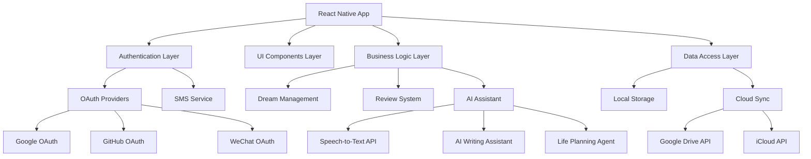
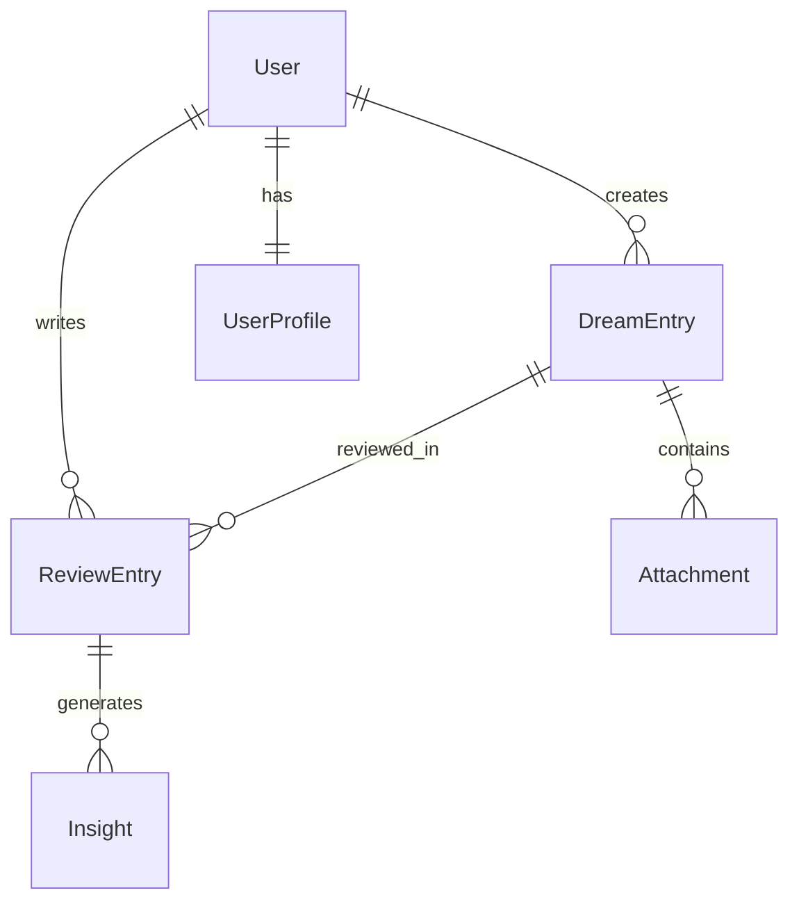

# 设计文档

## 概述

清晨梦想日记是一个基于React Native的跨平台应用，采用现代化的移动端架构设计。应用以用户体验为中心，通过简洁的界面设计和智能的AI辅助功能，帮助用户建立持续的梦想跟踪习惯。

## 架构

### 整体架构



### 技术栈

- **前端框架**: React Native (支持Android/iOS)
- **Web端**: React.js with React Native Web
- **状态管理**: Redux Toolkit + RTK Query
- **导航**: React Navigation 6
- **本地存储**: AsyncStorage + SQLite (react-native-sqlite-storage)
- **云同步**: Google Drive API, iCloud Documents API
- **认证**: Firebase Auth (支持多种OAuth provider)
- **加密**: react-native-keychain + crypto-js
- **AI服务**: OpenAI API / 本地化AI模型
- **语音识别**: react-native-voice
- **推送通知**: React Native Push Notification

## 组件和接口

### 核心组件架构

#### 1. 认证模块 (AuthenticationModule)
```typescript
interface AuthenticationService {
  signInWithGoogle(): Promise<UserCredential>
  signInWithGitHub(): Promise<UserCredential>
  signInWithWeChat(): Promise<UserCredential>
  signInWithPhoneNumber(phoneNumber: string, verificationCode: string): Promise<UserCredential>
  signOut(): Promise<void>
  getCurrentUser(): User | null
}
```

#### 2. 用户配置模块 (UserProfileModule)
```typescript
interface UserProfile {
  id: string
  nickname: string
  description: string
  theme: AppTheme
  preferences: UserPreferences
  createdAt: Date
  updatedAt: Date
}

interface UserProfileService {
  updateProfile(profile: Partial<UserProfile>): Promise<UserProfile>
  getProfile(userId: string): Promise<UserProfile>
  updateTheme(theme: AppTheme): Promise<void>
}
```

#### 3. 梦想日记模块 (DreamDiaryModule)
```typescript
interface DreamEntry {
  id: string
  userId: string
  content: string
  futureDate: Date
  createdAt: Date
  likes: number
  isLiked: boolean
  tags: string[]
  aiSuggestions?: string[]
}

interface DreamDiaryService {
  createDreamEntry(content: string, futureDate: Date): Promise<DreamEntry>
  getDreamEntries(userId: string, dateRange?: DateRange): Promise<DreamEntry[]>
  likeDreamEntry(entryId: string): Promise<void>
  getDreamEntryById(entryId: string): Promise<DreamEntry>
}
```

#### 4. 回顾系统模块 (ReviewSystemModule)
```typescript
interface ReviewEntry {
  id: string
  dreamEntryId: string
  userId: string
  reflection: string
  realizationStatus: RealizationStatus
  createdAt: Date
}

interface ReviewSystemService {
  getReviewableDreams(userId: string): Promise<DreamEntry[]>
  createReview(dreamEntryId: string, reflection: string, status: RealizationStatus): Promise<ReviewEntry>
  getReviewHistory(userId: string): Promise<ReviewEntry[]>
  generateInsights(userId: string): Promise<UserInsights>
}
```

#### 5. AI助手模块 (AIAssistantModule)
```typescript
interface AIAssistantService {
  speechToText(audioBlob: Blob): Promise<string>
  generateWritingSuggestions(content: string): Promise<string[]>
  generateLifePlanSuggestions(userProfile: UserProfile, dreamHistory: DreamEntry[]): Promise<LifePlanSuggestion[]>
  analyzeDreamPatterns(dreams: DreamEntry[]): Promise<DreamAnalysis>
}
```

### UI组件层次结构

```
App
├── AuthNavigator
│   ├── LoginScreen
│   ├── RegisterScreen
│   └── ForgotPasswordScreen
├── MainNavigator (Tab Navigator)
│   ├── HomeStack
│   │   ├── HomeScreen (今日梦想)
│   │   ├── DreamEntryScreen (记录梦想)
│   │   └── DreamDetailScreen (梦想详情)
│   ├── ReviewStack
│   │   ├── ReviewScreen (回顾列表)
│   │   ├── ReviewDetailScreen (回顾详情)
│   │   └── InsightsScreen (洞察分析)
│   ├── ProfileStack
│   │   ├── ProfileScreen (个人资料)
│   │   ├── SettingsScreen (设置)
│   │   └── ThemeScreen (主题选择)
│   └── AIAssistantStack
│       ├── VoiceInputScreen (语音输入)
│       ├── WritingAssistantScreen (写作助手)
│       └── LifePlanningScreen (人生规划)
```

## 数据模型

### 核心数据实体

#### User Entity
```typescript
interface User {
  id: string
  email?: string
  phoneNumber?: string
  profile: UserProfile
  authProviders: AuthProvider[]
  encryptionKey: string
  createdAt: Date
  lastLoginAt: Date
}
```

#### DreamEntry Entity
```typescript
interface DreamEntry {
  id: string
  userId: string
  title: string
  content: string
  targetDate: Date // 预期实现日期
  createdAt: Date
  updatedAt: Date
  status: DreamStatus // 'active' | 'completed' | 'abandoned'
  category: DreamCategory
  priority: Priority // 'low' | 'medium' | 'high'
  likes: number
  tags: string[]
  attachments?: Attachment[]
  aiMetadata?: AIMetadata
}
```

#### ReviewEntry Entity
```typescript
interface ReviewEntry {
  id: string
  dreamEntryId: string
  userId: string
  reflection: string
  realizationPercentage: number // 0-100
  emotionalState: EmotionalState
  lessonsLearned: string[]
  nextSteps: string[]
  createdAt: Date
}
```

### 数据关系



## 错误处理

### 错误分类和处理策略

#### 1. 网络错误
- **离线模式**: 应用应能在离线状态下正常记录梦想，待网络恢复后自动同步
- **同步冲突**: 实现智能合并策略，优先保留用户最新的本地更改
- **API限流**: 实现指数退避重试机制

#### 2. 认证错误
- **Token过期**: 自动刷新token，失败时引导用户重新登录
- **OAuth失败**: 提供备用登录方式，记录错误日志用于分析

#### 3. 数据错误
- **加密失败**: 降级到明文存储并警告用户
- **存储空间不足**: 提示用户清理旧数据或升级存储方案
- **数据损坏**: 从云端恢复备份数据

#### 4. AI服务错误
- **API调用失败**: 提供离线模式，使用本地缓存的建议
- **语音识别失败**: 允许用户手动输入文本
- **内容审核**: 实现客户端预过滤和服务端二次审核

### 错误监控和日志

```typescript
interface ErrorReportingService {
  logError(error: AppError, context: ErrorContext): void
  reportCrash(crashInfo: CrashInfo): void
  trackUserAction(action: UserAction, metadata?: any): void
}

interface AppError {
  code: string
  message: string
  severity: 'low' | 'medium' | 'high' | 'critical'
  category: ErrorCategory
  timestamp: Date
  userId?: string
  stackTrace?: string
}
```

## 测试策略

### 测试金字塔

#### 1. 单元测试 (70%)
- **业务逻辑测试**: 梦想创建、回顾生成、AI建议算法
- **工具函数测试**: 日期处理、加密解密、数据验证
- **Redux状态管理测试**: Actions, Reducers, Selectors

#### 2. 集成测试 (20%)
- **API集成测试**: 认证流程、数据同步、AI服务调用
- **数据库集成测试**: CRUD操作、数据迁移、备份恢复
- **第三方服务集成**: OAuth providers, 云存储服务

#### 3. E2E测试 (10%)
- **核心用户流程**: 注册登录 → 创建梦想 → 定期回顾
- **跨平台兼容性**: Android、iOS、Web端功能一致性
- **性能测试**: 应用启动时间、数据加载速度、内存使用

### 测试工具和框架

- **单元测试**: Jest + React Native Testing Library
- **集成测试**: Detox (React Native E2E)
- **API测试**: Supertest + Mock Service Worker
- **性能测试**: Flipper + React Native Performance Monitor
- **可访问性测试**: @testing-library/jest-native + Accessibility Inspector

### 持续集成策略

```yaml
# CI/CD Pipeline
stages:
  - lint_and_format
  - unit_tests
  - integration_tests
  - build_apps
  - e2e_tests
  - security_scan
  - deploy_staging
  - manual_qa
  - deploy_production
```

## 安全和隐私

### 数据加密策略

#### 1. 传输加密
- 所有API通信使用HTTPS/TLS 1.3
- 实现Certificate Pinning防止中间人攻击
- WebSocket连接使用WSS协议

#### 2. 存储加密
- 敏感数据使用AES-256-GCM加密
- 加密密钥存储在设备安全区域 (Keychain/Keystore)
- 数据库文件级别加密 (SQLCipher)

#### 3. 隐私保护
- 最小化数据收集原则
- 用户数据本地优先存储
- 云同步采用端到端加密
- 支持用户数据导出和删除

### 安全检查清单

- [ ] 输入验证和SQL注入防护
- [ ] XSS攻击防护
- [ ] CSRF令牌验证
- [ ] 敏感信息脱敏日志
- [ ] 定期安全依赖更新
- [ ] 代码混淆和反调试
- [ ] 生物识别认证支持
- [ ] 会话管理和超时控制

## 性能优化

### 应用性能目标

- **启动时间**: < 2秒 (冷启动)
- **页面切换**: < 300ms
- **数据加载**: < 1秒 (本地), < 3秒 (网络)
- **内存使用**: < 150MB (正常使用)
- **电池消耗**: 后台运行 < 2%/小时

### 优化策略

#### 1. 代码优化
- 使用React.memo和useMemo减少不必要渲染
- 实现虚拟列表处理大量数据
- 代码分割和懒加载非核心功能
- 图片压缩和WebP格式支持

#### 2. 数据优化
- 实现智能缓存策略
- 数据分页和增量加载
- 后台数据预取
- 离线数据同步优化

#### 3. 网络优化
- HTTP/2支持和连接复用
- GraphQL查询优化
- CDN加速静态资源
- 请求去重和批处理

## 可访问性设计

### 无障碍功能支持

- **屏幕阅读器**: 完整的语义化标签和描述
- **键盘导航**: 全功能键盘操作支持
- **视觉辅助**: 高对比度主题、字体大小调节
- **听觉辅助**: 视觉提示替代音频通知
- **运动辅助**: 减少动画、简化手势操作

### 国际化支持

- **多语言**: 中文、英文、日文等主要语言
- **本地化**: 日期格式、数字格式、文化适配
- **RTL支持**: 阿拉伯语、希伯来语等从右到左语言
- **时区处理**: 自动检测和转换用户时区